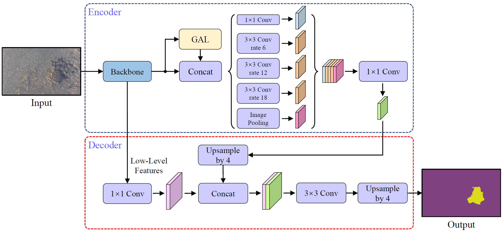
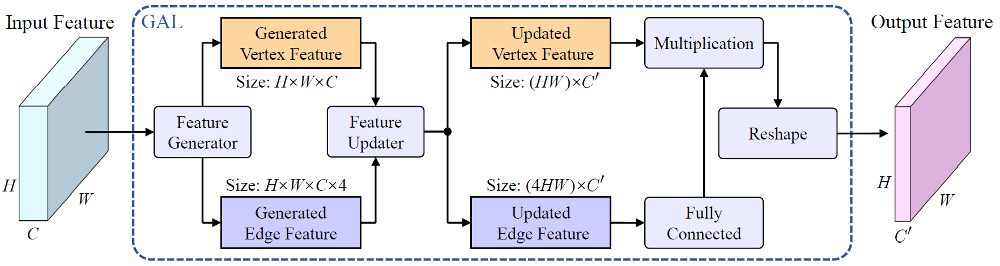

# GAL-DeepLabv3Plus

## Introduction

This is the official PyTorch implementation of **[Graph Attention Layer Evolves Semantic Segmentation for Road Pothole Detection: A Benchmark and Algorithms](https://ieeexplore.ieee.org/document/9547682)**, published on IEEE T-IP in 2021.

In this repository, we provide the training and testing setups on the [pothole dataset](https://drive.google.com/file/d/1ofp-44LnYTDByOuVMOc2hBrUCUjncg3k/view?usp=sharing) ([paper](https://ieeexplore.ieee.org/abstract/document/8809907)). We have tested our code in Python 3.8.10, CUDA 11.1, and PyTorch 1.10.1.

<p align="center">

</p>

<p align="center">

</p>

## Setup

Please setup the pothole dataset and the pretrained weight according to the following folder structure:

```
GAL-DeepLabv3plus
 |-- data
 |-- datasets
 |  |-- pothole
 |-- models
 |-- options
 |-- runs
 |  |-- tdisp_gal
 ...
```

The pothole dataset `datasets/pothole` can be downloaded from [here](https://drive.google.com/file/d/1ofp-44LnYTDByOuVMOc2hBrUCUjncg3k/view?usp=sharing), and the pretrained weight `runs/tdisp_gal` for our GAL-DeepLabv3+ can be downloaded from [here](https://drive.google.com/file/d/1wmgPUymOOPUWovwIwLdIg4hf0jsWyYja/view?usp=sharing).

## Usage

### Testing on the Pothole Dataset

For testing, please first setup the `runs/tdisp_gal` and the `datasets/pothole` folders as mentioned above. Then, run the following script:

```
bash ./scripts/test_gal.sh
```

to test GAL-DeepLabv3+ with the transformed disparity images. The prediction results are stored in `testresults`.

### Training on the Pothole Dataset

For training, please first setup the `datasets/pothole` folder as mentioned above. Then, run the following script:

```
bash ./scripts/train_gal.sh
```

to train GAL-DeepLabv3+ with the transformed disparity images. The weights and the tensorboard record containing the loss curves as well as the performance on the validation set will be saved in `runs`.

## Citation

If you use this code for your research, please cite our paper:

```
@article{fan2021graph,
  title     = {Graph Attention Layer Evolves Semantic Segmentation for Road Pothole Detection: A Benchmark and Algorithms},
  author    = {Fan, Rui and Wang, Hengli and Wang, Yuan and Liu, Ming and Pitas, Ioannis},
  journal   = {IEEE Transactions on Image Processing},
  volume    = {30},
  number    = {},
  pages     = {8144-8154},
  year      = {2021},
  publisher = {IEEE},
  doi       = {10.1109/TIP.2021.3112316}
}
```
If you use the pothole dataset for your research, please cite our papers:

```
@article{fan2019pothole,
  title={Pothole detection based on disparity transformation and road surface modeling},
  author={Fan, Rui and Ozgunalp, Umar and Hosking, Brett and Liu, Ming and Pitas, Ioannis},
  journal={IEEE Transactions on Image Processing},
  volume={29},
  pages={897--908},
  year={2019},
  publisher={IEEE}
}
@article{fan2019road,
  title={Road damage detection based on unsupervised disparity map segmentation},
  author={Fan, Rui and Liu, Ming},
  journal={IEEE Transactions on Intelligent Transportation Systems},
  volume={21},
  number={11},
  pages={4906--4911},
  year={2019},
  publisher={IEEE}
}
@article{fan2018road,
  title={Road surface 3D reconstruction based on dense subpixel disparity map estimation},
  author={Fan, Rui and Ai, Xiao and Dahnoun, Naim},
  journal={IEEE Transactions on Image Processing},
  volume={27},
  number={6},
  pages={3025--3035},
  year={2018},
  publisher={IEEE}
}
```


## Acknowledgement

Our code is inspired by [pytorch-CycleGAN-and-pix2pix](https://github.com/junyanz/pytorch-CycleGAN-and-pix2pix), [pytorch_segmentation](https://github.com/yassouali/pytorch_segmentation), [pytorch-deeplab-xception
](https://github.com/jfzhang95/pytorch-deeplab-xception), and [RTFNet](https://github.com/yuxiangsun/RTFNet).
